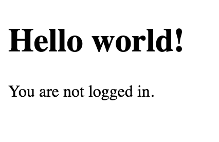
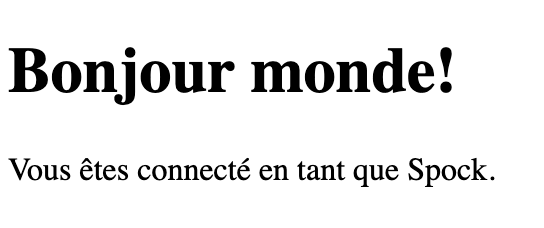
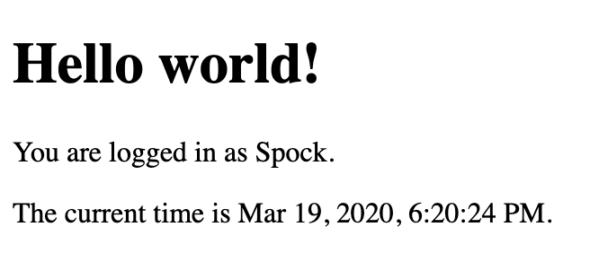

# Resources

**Read or watch:**
- [Flask-Babel](https://intranet.alxswe.com/rltoken/0m4Qykp52fFH-dPzlWIdkw)
- [Flask i18n tutorial](https://intranet.alxswe.com/rltoken/RtGz7pI7TKnYqrMMG9rWMg)
- [pytz](https://intranet.alxswe.com/rltoken/tw8sQWhB3HJvk3jmR2GBwg)

# Learning Objectives
- Learn how to parametrize Flask templates to display different languages
- Learn how to infer the correct locale based on URL parameters, user settings or request headers
- Learn how to localize timestamps

# Requirements
- All your files will be interpreted/compiled on Ubuntu 18.04 LTS using `python3` (version `3.7`)
- All your files should end with a new line
- A `README.md` file, at the root of the folder of the project, is mandatory
- Your code should use the `pycodestyle` style (version `2.5`)
- The first line of all your files should be exactly `#!/usr/bin/env python3`
- All your `*.py` files should be executable
- All your modules should have a documentation (`python3 -c 'print(__import__("my_module").__doc__)'`)
- All your classes should have a documentation (`python3 -c 'print(__import__("my_module").MyClass.__doc__)'`)
- All your functions and methods should have a documentation (`python3 -c 'print(__import__("my_module").my_function.__doc__)'` and `python3 -c 'print(__import__("my_module").MyClass.my_function.__doc__)'`)
- A documentation is not a simple word, it’s a real sentence explaining what’s the purpose of the module, class or method (the length of it will be verified)
- All your functions and coroutines must be type-annotated.

## Tasks

### 0. Basic Flask app

First you will setup a basic Flask app in `0-app.py`. Create a single `/` route and an `index.html` template that simply outputs “Welcome to Holberton” as page title (`<title>`) and “Hello world” as header (`<h1>`).

**Repo:**
- GitHub repository: `alx-backend`
- Directory: `0x02-i18n`
- File: `0-app.py, templates/0-index.html`

### 1. Basic Babel setup

Install the Babel Flask extension:

```bash
$ pip3 install flask_babel==2.0.0
```

Then instantiate the `Babel` object in your app. Store it in a module-level variable named `babel`.

In order to configure available languages in our app, you will create a `Config` class that has a `LANGUAGES` class attribute equal to `["en", "fr"]`.

Use `Config` to set Babel’s default locale (`"en"`) and timezone (`"UTC"`).

Use that class as config for your Flask app.

**Repo:**
- GitHub repository: `alx-backend`
- Directory: `0x02-i18n`
- File: `1-app.py, templates/1-index.html`

### 2. Get locale from request

Create a `get_locale` function with the `babel.localeselector` decorator. Use `request.accept_languages` to determine the best match with our supported languages.

**Repo:**
- GitHub repository: `alx-backend`
- Directory: `0x02-i18n`
- File: `2-app.py, templates/2-index.html`

### 3. Parametrize templates

Use the `_` or `gettext` function to parametrize your templates. Use the message IDs `home_title` and `home_header`.

Create a `babel.cfg` file containing

```babel
[python: **.py]
[jinja2: **/templates/**.html]
extensions=jinja2.ext.autoescape,jinja2.ext.with_
```

Then initialize your translations with

```bash
$ pybabel extract -F babel.cfg -o messages.pot .
```

and your two dictionaries with

```bash
$ pybabel init -i messages.pot -d translations -l en
$ pybabel init -i messages.pot -d translations -l fr
```

Then edit files `translations/[en|fr]/LC_MESSAGES/messages.po` to provide the correct value for each message ID for each language. Use the following translations:

|msgid|English|French|
|:----|:------|:-----|
home_title|"Welcome to Holberton"|"Bienvenue chez Holberton"
home_header|"Hello world!"|"Bonjour monde!"

Then compile your dictionaries with

```bash
$ pybabel compile -d translations
```

Reload the home page of your app and make sure that the correct messages show up.

**Repo:**

- GitHub repository: `alx-backend`
- Directory: `0x02-i18n`
- File: `3-app.py, babel.cfg, templates/3-index.html, translations/en/LC_MESSAGES/messages.po, translations/fr/LC_MESSAGES/messages.po, translations/en/LC_MESSAGES/messages.mo, translations/fr/LC_MESSAGES/messages.mo`

### 4. Force locale with URL parameter

In this task, you will implement a way to force a particular locale by passing the `locale=fr` parameter to your app’s URLs.

In your `get_locale` function, detect if the incoming request contains `locale` argument and ifs value is a supported locale, return it. If not or if the parameter is not present, resort to the previous default behavior.

Now you should be able to test different translations by visiting `http://127.0.0.1:5000?locale=[fr|en]`.

**Visiting `http://127.0.0.1:5000/?locale=fr` should display this level 1 heading:**


**Repo:**
- GitHub repository: `alx-backend`
- Directory: `0x02-i18n`
- File: `4-app.py, templates/4-index.html`

### 5. Mock logging in

Creating a user login system is outside the scope of this project. To emulate a similar behavior, copy the following user table in `5-app.py`.

```python
users = {
    1: {"name": "Balou", "locale": "fr", "timezone": "Europe/Paris"},
    2: {"name": "Beyonce", "locale": "en", "timezone": "US/Central"},
    3: {"name": "Spock", "locale": "kg", "timezone": "Vulcan"},
    4: {"name": "Teletubby", "locale": None, "timezone": "Europe/London"},
}
```

This will mock a database user table. Logging in will be mocked by passing `login_as` URL parameter containing the user ID to log in as.

Define a `get_user` function that returns a user dictionary or `None` if the ID cannot be found or if `login_as` was not passed.

Define a `before_request` function and use the `app.before_request` decorator to make it be executed before all other functions. `before_request` should use `get_user` to find a user if any, and set it as a global on `flask.g.user`.

In your HTML template, if a user is logged in, in a paragraph tag, display a welcome message otherwise display a default message as shown in the table below.

|msgid|English|French|
|:----|:------|:-----|
logged_in_as|"You are logged in as %(username)s."|"Vous êtes connecté en tant que %(username)s."|
not_logged_in|"You are not logged in."|"Vous n'êtes pas connecté."

**Visiting `http://127.0.0.1:5000/` in your browser should display this:**



**Visiting `http://127.0.0.1:5000/?login_as=2` in your browser should display this:**


**Repo:**
- GitHub repository: `alx-backend`
- Directory: `0x02-i18n`
- File: `5-app.py, templates/5-index.html`

### 6. Use user locale

Change your `get_locale` function to use a user’s preferred local if it is supported.

The order of priority should be

1. Locale from URL parameters
2. Locale from user settings
3. Locale from request header
4. Default locale

Test by logging in as different users



**Repo:**
- GitHub repository: `alx-backend`
- Directory: `0x02-i18n`
- File: `6-app.py, templates/6-index.html`

### 7. Infer appropriate time zone

Define a `get_timezone` function and use the `babel.timezoneselector` decorator.

The logic should be the same as `get_locale`:

1. Find `timezone` parameter in URL parameters
2. Find time zone from user settings
3. Default to UTC

Before returning a URL-provided or user time zone, you must validate that it is a valid time zone. To that, use `pytz.timezone` and catch the `pytz.exceptions.UnknownTimeZoneError` exception.

**Repo:**
- GitHub repository: `alx-backend`
- Directory: `0x02-i18n`
- File: `7-app.py, templates/7-index.html`

### 8. Display the current time

Based on the inferred time zone, display the current time on the home page in the default format. For example:

`Jan 21, 2020, 5:55:39 AM or 21 janv. 2020 à 05:56:28`

Use the following translations

|msgid|English|French|
|:----|:------|:-----|
|current_time_is|"The current time is %(current_time)s."|"Nous sommes le %(current_time)s."|

**Displaying the time in French looks like this:**


**Displaying the time in English looks like this:**



**Repo:**
- GitHub repository: `alx-backend`
- Directory: `0x02-i18n`
- File: `app.py, templates/index.html, translations/en/LC_MESSAGES/messages.po, translations/fr/LC_MESSAGES/messages.po`